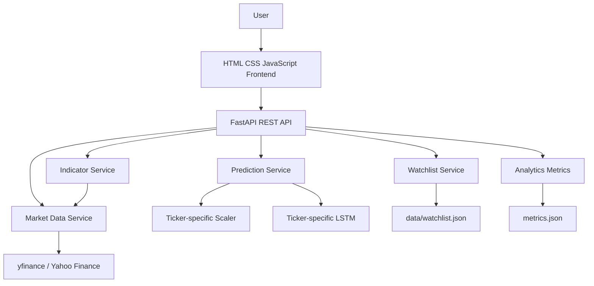
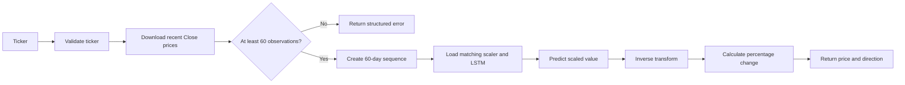

# MICRO PROJECT REPORT

## AI-Based Stock Price Prediction and Market Analysis System

**Submitted by**

- `[Student 1 full name]` (`[Examination number]`)
- `[Student 2 full name]` (`[Examination number]`)
- `[Student 3 full name]` (`[Examination number]`)

**Under the guidance of**

`[Guide name]`

**Department of MCA**  
**K. K. Wagh Institute of Engineering Education & Research**  
**Nashik - 422 003**  
**An Autonomous Institute since 2022-2023**  
**Academic Year 2026-2027**

---

# ABSTRACT

Stock market prices are influenced by many factors and are difficult to estimate using manual observation alone. This project presents an academic web-based system for stock market analysis and next-day closing-price prediction. The system combines live historical market data from Yahoo Finance with technical indicators and a Long Short-Term Memory (LSTM) neural network.

The system provides three main modules. The Stock Market Analysis module displays current price information, historical prices, volume, daily change, and technical indicators including SMA-20, SMA-50, EMA-20, RSI, and volatility. The AI Stock Price Prediction module estimates the next-day closing price using a trained LSTM model. The Watchlist and Model Analytics module allows users to store ticker symbols and view model evaluation information.

The supplied notebook was used as the source of truth for the LSTM implementation. The model uses AAPL historical closing prices from 2014-01-01 to 2025-01-01, MinMaxScaler preprocessing, a 60-trading-day lookback, two LSTM layers with 50 units, dropout of 0.2, a Dense output layer, Adam optimization, mean squared error loss, 20 epochs, and batch size 32. The notebook uses a chronological 80:20 split and does not randomly shuffle the time series.

The implemented system uses FastAPI for REST APIs and plain HTML, CSS, and JavaScript with Chart.js for the frontend. The exported AAPL model achieved an MAE of 5.2592, an RMSE of 6.7384, and an R-squared value of 0.9477 on the stored chronological test results. These metrics describe the saved experiment and must not be interpreted as a guarantee of future market performance. The system is intended for academic analysis only and does not execute trades or provide financial advice.

**Keywords:** FastAPI, LSTM, Machine Learning, Market Analysis, Stock Prediction, Technical Indicators, TensorFlow, Yahoo Finance

---

# TABLE OF CONTENTS

| Topic | Page No. |
|---|---:|
| Abstract | i |
| List of Figures | ii |
| List of Tables | iii |
| Abbreviations | iv |
| 1. Introduction | 1 |
| 2. Analysis | [ ] |
| 3. Design | [ ] |
| 4. Methodology | [ ] |
| 5. Results | [ ] |
| Conclusion | [ ] |
| Acknowledgements | [ ] |
| References | [ ] |

> Update page numbers after placing this report into the final Word document.

## LIST OF FIGURES

- Figure 1. System architecture
- Figure 2. Prediction workflow
- Figure 3. Historical closing-price chart
- Figure 4. Actual versus predicted closing prices
- Figure 5. Dashboard interface

## LIST OF TABLES

- Table 1. Functional requirements
- Table 2. Non-functional requirements
- Table 3. Technology stack
- Table 4. LSTM configuration
- Table 5. Model evaluation metrics
- Table 6. API endpoints

## ABBREVIATIONS

| Abbreviation | Meaning |
|---|---|
| API | Application Programming Interface |
| CSS | Cascading Style Sheets |
| DFD | Data Flow Diagram |
| EMA | Exponential Moving Average |
| HTML | HyperText Markup Language |
| LSTM | Long Short-Term Memory |
| MAE | Mean Absolute Error |
| MCA | Master of Computer Applications |
| REST | Representational State Transfer |
| RMSE | Root Mean Squared Error |
| RSI | Relative Strength Index |
| SMA | Simple Moving Average |

---

# 1. INTRODUCTION

## 1.1 Detailed Problem Definition

Stock market data is available in large volumes, but interpreting the data and estimating short-term price movement remains difficult. A user may need to inspect current prices, historical prices, volume, trends, and technical indicators before making an academic observation. These activities are often separated across different tools.

The problem addressed by this project is the design and development of a single web application that retrieves market data, calculates selected technical indicators, generates an LSTM-based next-day closing-price estimate, and presents the results through a clear dashboard.

The project is not designed as a trading platform. It does not connect to brokerage accounts, execute trades, manage investments, or guarantee profits.

## 1.2 Current Market Survey

Existing financial websites commonly provide charts, quote information, and technical indicators. However, an academic user may need a smaller and explainable system that demonstrates the complete path from data collection to model inference. Many platforms also hide their model implementation and evaluation process.

This project focuses on transparency. The data source, preprocessing, model architecture, lookback window, evaluation metrics, and limitations are explicitly documented. The prediction model is based on the supplied academic notebook and is primarily evaluated on AAPL data.

## 1.3 Need of the System

The system is needed to:

- combine market data and technical analysis in one interface;
- demonstrate a complete machine-learning deployment workflow;
- provide an explainable next-day closing-price prediction experiment;
- display actual evaluation metrics instead of invented accuracy claims;
- provide a simple watchlist without introducing unnecessary database complexity.

## 1.4 Objectives

- Develop a web-based stock market analysis system.
- Retrieve current and historical data using Yahoo Finance.
- Calculate SMA-20, SMA-50, EMA-20, RSI, and volatility.
- Reproduce the supplied notebook's LSTM preprocessing and architecture.
- Predict the next-day closing price from a 60-day Close-price sequence.
- Display model signal as UP, DOWN, or NEUTRAL rather than guaranteed BUY or SELL advice.
- Store a simple watchlist using a JSON file.
- Display actual model evaluation metrics and chronological test predictions.

## 1.5 Future Prospects

- Train and validate separate models for additional tickers.
- Add automated retraining under controlled offline workflows.
- Add a database if multi-user persistence becomes necessary.
- Add model versioning and experiment tracking.
- Add authenticated access for a multi-user deployment.
- Compare additional time-series models after proper validation.

## 1.6 Organization of the Report

Chapter 1 introduces the problem, objectives, need, and scope. Chapter 2 presents the requirements and feasibility analysis. Chapter 3 describes the system design and data flow. Chapter 4 explains the technologies, model, and implementation procedure. Chapter 5 presents the measured results. The conclusion summarizes achievements and limitations.

---

# 2. ANALYSIS

## 2.1 Project Plan

The project was implemented in the following stages:

- Notebook inspection and model-contract identification.
- Project structure and environment creation.
- Market data and technical indicator services.
- Notebook-compatible model export and inference support.
- FastAPI route implementation.
- Frontend dashboard and supporting pages.
- Watchlist and analytics integration.
- Syntax, helper-function, and endpoint validation.

## 2.2 Requirement Analysis

### 2.2.1 Necessary Functions

| Requirement | System response |
|---|---|
| Search a stock | The dashboard accepts a ticker symbol and retrieves live data. |
| View quote details | Current price, previous close, open, high, low, volume, and daily change are displayed. |
| View history | Historical OHLCV data is returned for selectable periods. |
| View indicators | SMA-20, SMA-50, EMA-20, RSI, and volatility are calculated. |
| Predict next-day close | The API loads the trained ticker-specific model and scaler. |
| View signal | The result is classified as UP, DOWN, or NEUTRAL using a small tolerance. |
| Maintain watchlist | Tickers can be added, listed, and removed from a JSON file. |
| View analytics | Persisted MAE, RMSE, R-squared, actual values, and predicted values are displayed when available. |

### 2.2.2 Desirable Functions

- Short-lived market-data caching.
- Responsive web layout.
- Loading and readable error messages.
- Chart.js visualizations.
- Swagger API documentation.
- Graceful behavior when model artifacts are missing.

### 2.2.3 Other Requirements

- Python 3.12 environment.
- Internet access for Yahoo Finance data.
- TensorFlow and Keras for model loading and training.
- A browser for the frontend.
- No brokerage credentials or financial account integration.

## 2.3 Feasibility Analysis

### 2.3.1 Technical Feasibility

The project is technically feasible because FastAPI provides lightweight REST endpoints, yfinance provides market-data access, TensorFlow provides the LSTM implementation, and browser technologies provide charts and interaction without a frontend framework.

### 2.3.2 Economic Feasibility

The project uses open-source Python libraries and a public market-data access library. No paid brokerage integration, hosting service, or database is required for the academic prototype.

### 2.3.3 Operational Feasibility

The application can be started with a small number of commands. Users can search a ticker, view analysis, request a prediction, and manage a watchlist through browser pages.

## 2.4 Scope and Boundaries

The system supports market analysis for valid tickers returned by Yahoo Finance. Model prediction is available only when a matching trained model and scaler exist. The original notebook produces an AAPL model; the notebook also contains a multi-stock export workflow for separately trained ticker artifacts. The system does not treat an AAPL model as a universal model.

---

# 3. DESIGN

## 3.1 System Architecture

**Figure 1. System architecture.** The application separates browser presentation, API routing, data services, model inference, and JSON persistence.

## 3.2 Data Flow

**Figure 2. Prediction workflow.** The inference pipeline uses the selected ticker's own model artifacts and compares the predicted close with the current close.

## 3.3 Database and Persistence Design

The project does not use a relational database. The watchlist is stored in `data/watchlist.json`. Model files, scalers, and evaluation data are stored in `ml/model/`. This design is suitable for a single-user academic prototype but is not intended for concurrent multi-user production use.

## 3.4 API Design

| Method | Endpoint | Purpose |
|---|---|---|
| GET | `/` | Serve the dashboard. |
| GET | `/health` | Report API status and base artifact availability. |
| GET | `/stocks/{ticker}` | Return the latest quote. |
| GET | `/stocks/{ticker}/history?period=1y` | Return historical OHLCV data. |
| GET | `/stocks/{ticker}/indicators` | Return technical indicator series. |
| POST | `/predict` | Return a next-day estimate using the matching ticker model. |
| GET | `/watchlist` | Return saved tickers. |
| POST | `/watchlist` | Add a ticker without duplicates. |
| DELETE | `/watchlist/{ticker}` | Remove a ticker. |
| GET | `/analytics` | Return persisted evaluation data. |

**Table 6. API endpoints.** The API uses JSON request and response bodies and returns readable errors for unavailable data or artifacts.

## 3.5 User Interface Design

The frontend contains five pages:

- Dashboard: quote summary, historical price chart, and technical indicators.
- Prediction: ticker input, predicted close, percentage movement, and signal.
- Watchlist: tracked tickers, current prices, predictions, and remove action.
- Analytics: MAE, RMSE, R-squared, and actual-versus-predicted chart.
- About: project purpose, methodology, and limitations.

**Figure 3. Historical closing-price chart.** Insert a screenshot of the dashboard chart here.  
**Figure 4. Actual versus predicted closing prices.** Insert a screenshot of the analytics chart here.  
**Figure 5. Dashboard interface.** Insert a screenshot of the running application here.

---

# 4. METHODOLOGY

## 4.1 Software Used

- Python 3.12.
- FastAPI and Uvicorn.
- TensorFlow and Keras.
- scikit-learn.
- pandas and NumPy.
- yfinance.
- ta for technical indicators.
- HTML, CSS, and JavaScript.
- Chart.js.
- Visual Studio Code.

## 4.2 Hardware Specification

The application does not require specialized hardware for normal operation. The following specification should be replaced with the actual system used by the group:

| Component | Specification |
|---|---|
| Processor | `[Enter processor model]` |
| RAM | `[Enter RAM]` |
| Storage | `[Enter storage]` |
| Operating system | Windows |
| Internet | Required for market-data download |

## 4.3 Programming Languages

- Python was used for services, machine learning, and REST APIs.
- HTML was used for page structure.
- CSS was used for styling and responsive layout.
- JavaScript was used for API communication and chart rendering.

## 4.4 Platform

The application was developed in Visual Studio Code on Windows. FastAPI served the application locally using Uvicorn. The browser communicated with the API using REST-style HTTP requests.

## 4.5 Components

### 4.5.1 Market Data Service

The market data service validates ticker symbols, downloads data using yfinance, handles empty results and network failures, returns current quote data, and provides historical OHLCV records. A short-lived in-memory cache reduces repeated downloads during normal dashboard use.

### 4.5.2 Indicator Service

The indicator service calculates the same indicator definitions used by the notebook:

- SMA-20: 20-period simple moving average.
- SMA-50: 50-period simple moving average.
- EMA-20: 20-period exponential moving average.
- RSI: 14-period Relative Strength Index.
- Volatility: 20-period rolling standard deviation of daily returns.

### 4.5.3 LSTM Prediction Service

The prediction service loads a model and scaler once or loads the matching ticker-specific pair for a request. It transforms the latest 60 Close prices, reshapes the sequence to `(1, 60, 1)`, predicts the scaled next value, and applies the scaler's inverse transform.

The predicted percentage movement is calculated as:

`((predicted_price - current_price) / current_price) * 100`

The signal is UP when the movement is greater than 0.05 percent, DOWN when it is less than -0.05 percent, and NEUTRAL otherwise.

### 4.5.4 Watchlist Service

The watchlist service stores uppercase ticker symbols in a JSON array. It prevents duplicates and supports add, list, and remove operations. It does not claim that every saved symbol has valid market data.

## 4.6 Tools

- Visual Studio Code for development.
- Jupyter notebook support for model experimentation and export.
- FastAPI Swagger UI for API inspection.
- Chart.js for browser charts.
- PowerShell for environment setup and application startup.

## 4.7 Methods and Procedures

1. The supplied notebook was inspected to identify its ticker, date range, indicators, preprocessing, model architecture, training parameters, and evaluation process.
2. AAPL historical data was downloaded for the notebook's date range.
3. Close prices were extracted and scaled using `MinMaxScaler(feature_range=(0, 1))`.
4. A sequence generator created samples from 60 previous observations to predict the next observation.
5. The sequence data was split chronologically into 80 percent training data and 20 percent test data.
6. The LSTM model was trained with two 50-unit LSTM layers, dropout of 0.2, Dense(1), Adam, mean squared error, 20 epochs, and batch size 32.
7. Test predictions were inverse-transformed into the original price scale.
8. MAE, RMSE, and R-squared were calculated and stored in `metrics.json`.
9. The model and scaler were exported for API inference.
10. FastAPI routes were implemented for market data, indicators, prediction, watchlist, health, and analytics.
11. The frontend called the API using `fetch()` and displayed results with HTML, CSS, and Chart.js.
12. The application was checked using Python compilation, JavaScript syntax validation, sequence tests, and manual browser checks.

## 4.8 LSTM Configuration

| Parameter | Value |
|---|---|
| Dataset ticker | AAPL for the original notebook model |
| Input feature | Close price only |
| Date range | 2014-01-01 to 2025-01-01 |
| Scaler | MinMaxScaler, feature range `(0, 1)` |
| Lookback | 60 trading days |
| First recurrent layer | LSTM, 50 units, return sequences true |
| Second recurrent layer | LSTM, 50 units, return sequences false |
| Dropout | 0.2 after each LSTM layer |
| Output | Dense(1) |
| Optimizer | Adam |
| Loss | Mean squared error |
| Epochs | 20 |
| Batch size | 32 |
| Split | Chronological 80:20 |

**Table 4. LSTM configuration.** Values are taken from the supplied notebook and its export workflow.

---

# 5. RESULTS

## 5.1 Model Evaluation

The stored metrics were generated from the exported AAPL LSTM test predictions:

| Metric | Value |
|---|---:|
| MAE | 5.2592 |
| RMSE | 6.7384 |
| R-squared | 0.9477 |

**Table 5. Model evaluation metrics.** MAE and RMSE are measured in the original closing-price units. R-squared is a regression metric and is not called accuracy in this report.

The model output follows the general movement pattern of the test series, but prediction error remains present. The values are based on one historical experiment and do not establish reliable future performance.

## 5.2 Application Results

The completed application provides:

- live current quote information for valid tickers;
- historical OHLCV data and closing-price charts;
- five technical indicators;
- next-day prediction when matching model artifacts are available;
- UP, DOWN, and NEUTRAL model signals;
- JSON-backed watchlist operations;
- evaluation metrics and actual-versus-predicted visualization;
- graceful errors for invalid tickers, unavailable data, insufficient observations, and missing model artifacts.

## 5.3 Testing Performed

| Test | Result |
|---|---|
| Python source compilation | Passed |
| JavaScript syntax check | Passed |
| Sequence shape test | Implemented |
| 60-observation sequence validation | Implemented |
| Notebook JSON validation | Passed |
| FastAPI health route | Requires installed runtime dependencies |
| Live Yahoo Finance retrieval | Requires network access |
| Browser rendering | Manually checked |
| Model export | Depends on notebook execution and available data |

The project should only report live API and model tests as passed after they are executed in the final configured environment.

## 5.4 Limitations of Results

- The original trained model is based on AAPL.
- Other ticker predictions require separate model and scaler artifacts.
- Yahoo Finance data may be delayed, changed, unavailable, or rate-limited.
- A historical test score does not guarantee future results.
- The model uses Close price only for the LSTM prediction.
- The system does not include news, sentiment, macroeconomic variables, or portfolio risk analysis.

---

# CONCLUSION

The project developed an academic web application for stock market analysis and next-day closing-price prediction. It connected a notebook-based LSTM workflow to a FastAPI backend and a browser frontend. The resulting system retrieves market data, calculates technical indicators, displays charts, performs model inference when appropriate artifacts are available, manages a simple watchlist, and presents stored evaluation metrics.

The supplied notebook was preserved as the machine-learning source of truth. Its AAPL Close-price preprocessing, 60-day sequence construction, LSTM architecture, training configuration, and chronological evaluation were used in the deployment workflow. The recorded evaluation produced an MAE of 5.2592, an RMSE of 6.7384, and an R-squared value of 0.9477 for the stored test results.

The project demonstrates the practical steps required to move an academic machine-learning experiment into a small web application. It also shows why ticker-specific model artifacts are necessary when a model has been trained on one stock. The system is an analytical and educational prototype, not a financial advisory or automated trading product.

---

# ACKNOWLEDGEMENTS

The group expresses its sincere gratitude to `[Guide name]` for guidance and suggestions during the development of this project. The group also thanks the Department of MCA, K. K. Wagh Institute of Engineering Education & Research, for providing the academic environment and resources required to complete the work.

---

# REFERENCES

1. Supplied project notebook, `Stock_Price_Prediction (1).ipynb`.
2. FastAPI Documentation, https://fastapi.tiangolo.com/
3. TensorFlow Keras Documentation, https://www.tensorflow.org/guide/keras
4. scikit-learn Documentation, https://scikit-learn.org/stable/
5. pandas Documentation, https://pandas.pydata.org/docs/
6. NumPy Documentation, https://numpy.org/doc/
7. yfinance Python Library Documentation, https://ranaroussi.github.io/yfinance/
8. Chart.js Documentation, https://www.chartjs.org/docs/
9. Technical Analysis Library in Python, https://technical-analysis-library-in-python.readthedocs.io/

---

# FINAL FORMATTING CHECKLIST

Apply the following settings when converting this draft to Word:

- Use A4 paper.
- Set the left margin to 3 cm.
- Set the right, top, and bottom margins to 2 cm.
- Use Arial bold, 16 pt, left-aligned numbered text for chapter headings.
- Use Arial bold, 14 pt, left-aligned, title-case text for first-level headings.
- Use Arial bold, 12 pt, left-aligned, title-case text for second-level headings.
- Use Times New Roman, 11 pt, justified, single-line spacing for normal text.
- Keep the abstract within one page.
- Place figure captions below figures and center-align them.
- Place table captions above tables and center-align them.
- Do not use a header.
- Add a footer with the project title on the left and `Page X of Y` on the right.
- Number preliminary pages using Roman numerals.
- Start Arabic page numbering from the Introduction.
- Use filled circular or square bullets for lists.
- Replace all bracketed placeholders before submission.
- Insert screenshots and diagrams at the marked figure locations.
- Update the table of contents and page numbers after final pagination.
